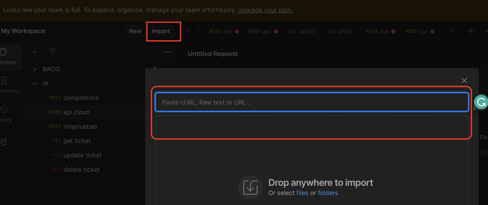

# API DOC FOR CHATBOT IMPLEMENTATION 🤖
## Introduction
This is a Cloud Functions Project made with the goal of creating a service that recognizes any text in natural language from the user and processes the message, extracts the environments to create a ticket, this ticket will be saved and with other services can be getting, updating and deleting if the client wants.

## Tools ⚙️
```
Cloud functions from Google Cloud Platform
Real time database in Firestore from Google Cloud Platform
Python
openai ChatBot
```

## How to start?

You only have to see my API list and with the help of Postman or another similar tool take the cURLS’s examples and import them into your tool to consume the services

for example:

- I have my cRUL example and going to postman tool and in the import option click, finally paste my cURL in the blanck space:



- next step, click in import and change the testing data finally send the request!!

# API LIST
## API 1: Endpoint to receive natural language reports of problems with bots

```
curl --location 'https://supcustomkiwibot-qyfoq6f2ca-uc.a.run.app' \
--header 'Content-Type: application/json' \
--data '{
  "message": "The bot AA-123 is broken"
}'
```

### Description

This API gets the message from the user. It extracts the Kiwibot code ID type to reference it, (for example, my KiwiBot has the code “LLS-098”), which is my reference to search it in a JSON file, if my bot exists, get the heartbeat and processes the ubication's data, finally with my initial message whi help of open IA, y extract the problem type and classified it in software, hardware o custom field.

next, build a JSON with the ticket information, and It'll be saved in Firestore

The JSON field has next invented bots codes incorporated:

```
LLS-098
BBD-028
JSU-378
SYS-272
```

you can use anyone o the last codes or nothing

### Parameters

| Param        | Type   | Description                 |
|--------------|--------|-----------------------------|
| message      | string | the user message            |
------------------------------------------------------

### Result

You going to receive the confirmation of the ticket creation and the API return ticket ID, something like that:

```
{
    "message": "successful ticket created",
    "ticket_id": "TK285"
}
```

## API 2: Endpoint to getting my ticket

CURL Endpoint: 

```
curl --location 'https://crud-firestore-qyfoq6f2ca-uc.a.run.app?ticket_id=TK281'
```

### Description

This API gets my ticket saved in firestore and return a JSON with all my information about the problem:

```
[
    {
        "bot_id": "LLS-098",
        "problem_location": "Palo Alto, California.",
        "problem_type": "Software",
        "status": "open",
        "summary": "El bot LLS-098 se encuentra atrofiado por falta de matenimiento en su software no lleva el pedido a donde deberia enviarse",
        "ticket_id": "TK281"
    }
]
```

### Query Params

| Param        | Type   | Description                 |
|--------------|--------|-----------------------------|
| ticket_id    | string | My ticket ID                |
------------------------------------------------------


## API 3: Endpoint to update my ticket

CURL Endpoint: 

```
curl --location --request PUT 'https://crud-firestore-qyfoq6f2ca-uc.a.run.app' \
--header 'Content-Type: application/json' \
--data '{
        "bot_id": "LLS-098",
        "problem_location": "Palo Alto, California.",
        "problem_type": "Software",
        "status": "closed",
        "summary": "El bot LLS-098 se encuentra atrofiado por falta de matenimiento en su software no lleva el pedido a donde deberia enviarse",
        "ticket_id": "TK279"
    }'
```

### Description

This API update my ticket saved by ticket_id in firestore and return a confirmation of my changes:

```
TICKET UPDATED
```

you can change the ticket status or If you prefer to delete the ticket you can use the next endpoint

### Parameters

| Param           | Type   | Description              | is required |
|-----------------|--------|--------------------------|-------------|
| bot_id          | string | kiwidbot code            |    false    |
| problem_location| string | name location            |    false    |
| problem_type    | string | software/hardware/field  |    false    |
| status          | string | created/active/closed    |    false    |
| summary         | string | summary problem          |    false    |
| ticket_id       | string | your ID ticket           |     true    |
---------------------------------------------------------------------


## API 4: Endpoint to delete my ticket

CURL Endpoint: 

```
curl --location --request DELETE 'https://crud-firestore-qyfoq6f2ca-uc.a.run.app?ticket_id=TK279'
```

### Description

This API delete my ticket saved in firestore and return confirmation of my change

```
TICKET DELETED
```

### Query Params

| Param        | Type   | Description                 |
|--------------|--------|-----------------------------|
| ticket_id    | string | My ticket ID                |
------------------------------------------------------
